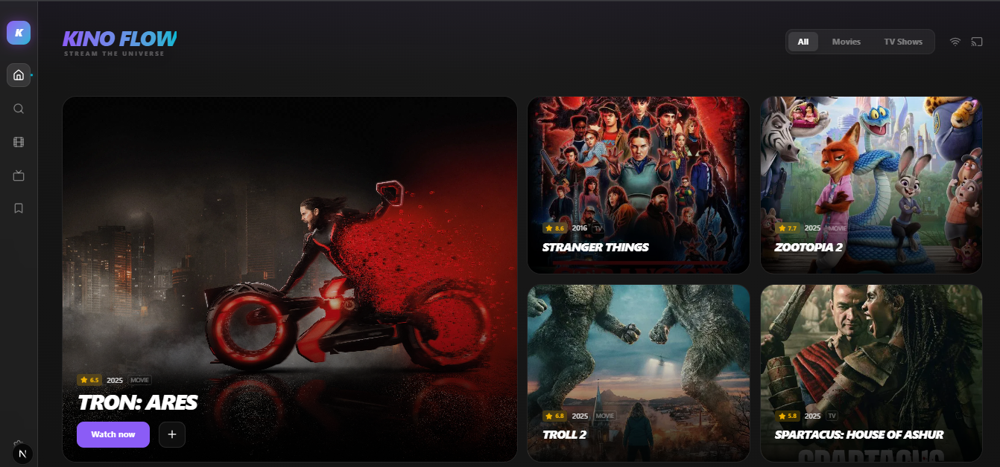

# Kino Flow

**The next-generation media discovery dashboard. Beautiful, fast, and fluid.**



## ⚡ Introduction

**Kino Flow** is a high-performance web application designed to redefine how users explore movies and TV shows. Moving away from the generic "Netflix-clone" layout, Kino Flow utilizes a **modern Bento-Grid architecture**, smooth **physics-based animations**, and a **glassmorphic design system** to create an immersive user experience.

Built with the latest web technologies, it features real-time data synchronization with TMDB, a responsive command-bar interface, and a focus on micro-interactions.

## 🚀 Live Demo

**[Click here to launch Kino Flow]((https://vercel.com/abdullahpros-projects/kino-flow))**
*(Note: If the link is not active yet, the project is currently in early access).*

## ✨ Key Features

### 🎨 **UI & UX Design**
* **Bento Grid Layout:** A high-density, modular interface that adapts perfectly to any screen size.
* **Glassmorphism:** Deep "void black" backgrounds paired with frosted glass overlays (`backdrop-blur-xl`) for a premium feel.
* **Physics-Based Animations:** Powered by **Framer Motion**, every hover, click, and transition feels weightless and smooth.

### 🛠 **Functionality**
* **Real-Time Data:** Fetches the latest trending movies, top-rated shows, and metadata via the **TMDB API**.
* **Instant Search:** "Hack-style" search capabilities that query the database as you type.
* **Smart Fallbacks:** Intelligent placeholder generation for missing media assets.
* **Responsive Player:** Integrated video interface with support for HLS and MP4 streaming.

## 🏗️ Tech Stack

This project uses the **T3 Stack** philosophy for maximum performance and type safety.

| Component | Technology | Description |
| :--- | :--- | :--- |
| **Framework** | **Next.js 14** | App Router, Server Actions, & SSR. |
| **Language** | **TypeScript** | Strict type safety for robust code. |
| **Styling** | **Tailwind CSS** | Utility-first CSS for rapid design capability. |
| **Animations** | **Framer Motion** | Complex layout transitions and gestures. |
| **Icons** | **Lucide React** | Clean, lightweight SVG icons. |
| **Data Source** | **TMDB API** | The Movie Database integration. |
| **Player** | **Vidstack** | Modern, accessible video player components. |

## 💻 Getting Started (Run Locally)

Follow these steps to set up the project on your local machine.

### 1. Clone the Repository
```bash
git clone [https://github.com/AbdullahPro784/kino-flow.git](https://github.com/AbdullahPro784/kino-flow.git)
cd kino-flow
````

### 2\. Install Dependencies

```bash
npm install
# or
yarn install
```

### 3\. Environment Setup (Crucial)

Create a file named `.env.local` in the root directory. You need a TMDB API key (free).

```env
NEXT_PUBLIC_TMDB_API_KEY=your_tmdb_api_key_here
NEXT_PUBLIC_TMDB_IMAGE_URL=[https://image.tmdb.org/t/p/original](https://image.tmdb.org/t/p/original)
```

### 4\. Run the Development Server

```bash
npm run dev
```

Open [http://localhost:3000](https://www.google.com/search?q=http://localhost:3000) with your browser to see the result.

## 🔮 Roadmap

  * [x] **Phase 1:** Core UI, Bento Grid, and TMDB Integration.
  * [ ] **Phase 2:** User Authentication (Supabase) for Watchlists.
  * [ ] **Phase 3:** "Stream Engine" integration (Debrid/Source resolving).
  * [ ] **Phase 4:** Social features (Share lists with friends).

## 🤝 Contributing

Contributions are what make the open-source community such an amazing place to learn, inspire, and create. Any contributions you make are **greatly appreciated**.

1.  Fork the Project
2.  Create your Feature Branch (`git checkout -b feature/AmazingFeature`)
3.  Commit your Changes (`git commit -m 'Add some AmazingFeature'`)
4.  Push to the Branch (`git push origin feature/AmazingFeature`)
5.  Open a Pull Request

## 👤 Author

**Abdullah**

  * GitHub: [@AbdullahPro784](https://www.google.com/search?q=https://github.com/AbdullahPro784)

-----

*Built with ❤️ and a lot of caffeine.*

````
